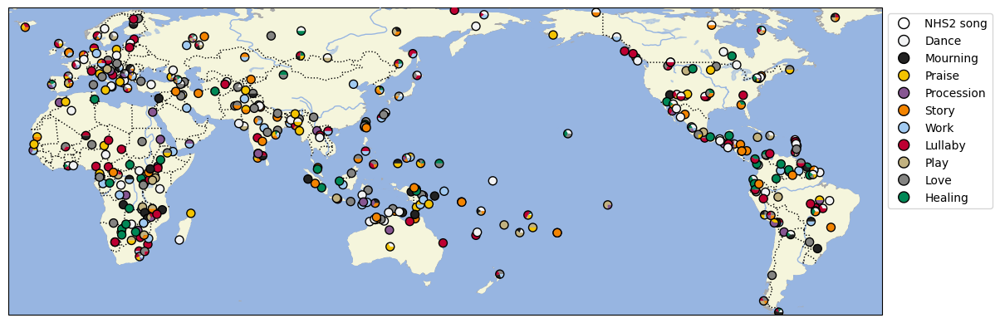

# D-PLACE dataset derived from Bertolo et al. 2023 'Cross-cultural music corpus: The Expanded Natural History of Song Discography'

## How to cite

If you use these data please cite
- the original source
  > Mila Bertolo, Martynas Snarskis, Manvir Singh, & Samuel Mehr. (2023, August 8). Cross-cultural music corpus: The Expanded Natural History of Song Discography. Zenodo. https://doi.org/10.5281/zenodo.8378337
- the derived dataset using the DOI of the [particular released version](../../releases/) you were using

## Description

The Expanded Natural History of Song Discography contains more than 1000 audio recordings of vocal music gathered from many human societies, each annotated with a world region, language, and behavioural context.

This dataset is licensed under a CC-BY-4.0 license

Available online at https://doi.org/10.5281/zenodo.8378337

## CLDF Datasets

The following CLDF datasets are available in [cldf](cldf):

- CLDF [StructureDataset](https://github.com/cldf/cldf/tree/master/modules/StructureDataset) at [cldf/StructureDataset-metadata.json](cldf/StructureDataset-metadata.json)